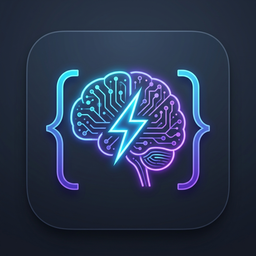

<p align="center">
  
</p>

<h1 align="center">Gestor de Skills IA para Visual Studio Code & Cursor</h1>

<p align="center">
  <a href="https://code.visualstudio.com/"></a>
  <a href="https://cursor.com/"></a>
  <a href="https://opensource.org/licenses/MIT"></a>
  <a href="https://deepmind.google/technologies/gemini/"></a>
</p>

Extensión para **Visual Studio Code, Cursor y Antigravity** diseñada para explorar, gestionar, crear, sincronizar, respaldar e invocar rápidamente habilidades de agente (**Agent Skills**) mediante comandos de chat (`/skill`) o peticiones semánticas.

Compatible con el **Estándar Abierto de Agent Skills** (adoptado por Anthropic Claude Code, Cursor, Antigravity/Gemini y herramientas CLI).

---

## ¿Qué son las Skills y por qué esta extensión?

Las **Agent Skills** son paquetes modulares de instrucciones y procedimientos almacenados en carpetas con un archivo `SKILL.md` estructurado con YAML frontmatter. Permiten a los agentes de IA (como Antigravity, Claude Code o Cursor) ejecutar tareas especializadas, seguir guías de arquitectura y aplicar flujos de trabajo sin sobrecargar la memoria de contexto (*Progressive Disclosure*).

A medida que acumulas habilidades, gestionarlas a mano genera fricción: no sabes en qué carpeta residen, temes borrarlas por accidente o duplicarlas y saturar el contexto de la IA. **Gestor de Skills IA** centraliza todo el ciclo de vida de tus habilidades:
* 🗄️ **Baúl de Referencia (BACKUP):** Tu almacén privado para guardar copias maestras fuera del radar de los agentes.
* 🛡️ **Borrado Seguro Anti-Pérdida:** Respaldo automático preventivo antes de eliminar cualquier habilidad activa.
* 🤖 **Soporte Multi-Agente (+60 Agentes):** Detección automática y despliegue rápido a Claude Code, Antigravity, Windsurf, Continue, OpenHands, Devin, Goose, Roo, Cursor y más de 60 herramientas.
* 🔄 **Transferencias y Despliegue Directo:** Mueve, copia o enlaza habilidades en un clic entre Local, Global, Baúl y agentes específicos.
* 🔍 **Buscador Rápido:** Encuentra y copia comandos slash (`/nombre-skill`) al vuelo con `Cmd+Shift+K`.
* 🌐 **Soporte Multi-IDE con Espejo:** Sincronización automática entre estándares universales (`~/.agents`), Google Antigravity (`~/.gemini`) y Claude Code (`~/.claude`).

---

## Guía Visual: Explicación de Cada Apartado de la App

Al hacer clic en el icono de robot (**Skills IA**) en la barra lateral de VS Code, encontrarás la interfaz dividida en los siguientes apartados claramente diferenciados:

```text
BARRA SUPERIOR:  [+]  [🔍]  [👁️]  [🔄]  [☁️]  [📦]  [🗂️]
────────────────────────────────────────────────────────
▼ ⭐ Favoritas (3)
    ⭐ /domain-checker
    ⭐ /smart-commit
    ⭐ /wrangler
▼ ⚡ Mis Habilidades (27)
  ▶ 🌐 Global (26)
  ▶ 📁 Local (0)
  ▶ 📁 toolchain (1)
▼ 🗄️ Baúl de Referencia (28)
  ▶ 🌐 Global (27)
  ▶ 📁 toolchain (1)
▼ 🌐 Catálogo Remoto GitHub (250+)
  ▶ 📁 Frameworks (45)
  ▶ 📁 Testing (32)
```

### 1. La Barra Superior (Herramientas de Control)
Situada en la cabecera del panel lateral, te permite ejecutar acciones globales con un solo clic:
* **`+` (Crear nueva habilidad):** Inicia un asistente interactivo paso a paso para crear una nueva skill en **Local**, **Global** o directamente en el **Baúl**.
* **`🔍` (Buscar habilidad):** Abre el buscador instantáneo con teclado (también accesible con `Cmd+Shift+K` / `Ctrl+Shift+K`).
* **`👁️ / 👁️‍🗨️` (Ocultar / Mostrar inactivas):** Filtra la lista para ver solo las habilidades activas o incluir también las desactivadas.
* **`🔄` (Recargar lista):** Reescanea de inmediato todas las carpetas del sistema y actualiza el árbol.
* **`☁️` (Sincronizar desde GitHub):** Actualiza el catálogo comunitario de GitHub ejecutando `git pull`.
* **`📦 / 🗄️` (Respaldar todas las Skills en el Baúl):** Añade o actualiza una copia de seguridad de todas tus habilidades activas (locales y globales) en el Baúl con un solo clic.
* **`🗂️` (Consolidar Skills Globales):** Sincroniza en espejo las skills globales entre todas las carpetas del sistema (`~/.agents`, `~/.gemini`, `~/.claude`, `~/.cursor`).

---

### 2. ⭐ Apartado: Favoritas
* **Qué contiene:** Acceso directo a las habilidades que usas todos los días.
* **Cómo se usa:** Pasa el cursor sobre cualquier habilidad y pulsa el icono de estrella (**`⭐`**) para marcarla o desmarcarla.
* **Comportamiento:** Si no tienes ninguna favorita marcada, esta sección se oculta automáticamente para mantener tu panel limpio.

---

### 3. ⚡ Apartado: Mis Habilidades (En Uso / Activas)
* **Qué contiene:** Todas las habilidades que están **actualmente activas y al alcance de tus agentes de IA**.
* **Estructura visual clara y diferenciada:**
  * 🌐 **Global:** Habilidades globales instaladas en tu máquina (`~/.agents/skills/`, `~/.gemini/config/skills/`), listas para usar en cualquier proyecto.
  * 📁 **Local:** Nuevo elemento que muestra las habilidades del proyecto localmente (`.agents/skills/`). Si no hay ninguna instalada en el proyecto abierto, muestra `Local (0)` y al desplegar te orienta con un mensaje para añadir una con un solo clic.
  * 📁 **Categorías temáticas:** Agrupaciones específicas si las habilidades declaran categoría en su YAML (por ejemplo `toolchain`).
* **Botonera unificada de acciones (en cada habilidad):**
  Todas las habilidades cuentan con la misma botonera de acciones directas en línea:
  * 📁 **`Copiar a Local`:** Transfiere o actualiza la habilidad en la carpeta local del proyecto (`.agents/skills`).
  * 🌐 **`Copiar a Global`:** La promueve a universal (`~/.agents/skills` con réplica en espejo en `~/.gemini/config/skills`).
  * 🤖 **`Desplegar en Agente...`:** Despliega o enlaza simbólicamente la habilidad hacia cualquiera de los agentes de IA detectados en tu máquina.
  * ⭐ **`Marcar / Desmarcar favorita`:** Añade o retira la skill de tu lista rápida de favoritas.
  * 📋 **`Copiar comando de mención`:** Copia el comando slash (`/nombre-skill`) listo para pegar en el chat de la IA.
  * 📖 **`Ver documentación`:** Abre el archivo `SKILL.md` al lado de tu código en el editor.
  * 🗑️ **`Eliminar habilidad`:** Borra la habilidad activa con red de seguridad (con respaldo preventivo automático al Baúl).

---

### 4. 🗄️ Apartado: Baúl de Referencia (Tu Carpeta de BACKUP Privada)

El **Baúl de Referencia** es tu almacén seguro personal para resguardar copias maestras fuera del alcance de los agentes.

#### ¿Dónde está ubicado físicamente?
Por defecto se ubica en:
```text
~/.skills-backup/
```
*(Puedes cambiar esta ruta desde los ajustes con `skillsManager.backupSkillsPath`).*

#### ¿Por qué una carpeta de Backup fuera de las rutas estándar?
1. **Invisibilidad para los Agentes de IA:** Los agentes escanean `.agents/` o `~/.agents/`. Si guardaras decenas de habilidades antiguas o de prueba en esas rutas, la IA consumiría tokens innecesarios leyendo descripciones que no vas a usar o se confundiría con instrucciones duplicadas. **El Baúl no es escaneado por los agentes**, manteniendo su contexto ligero y veloz.
2. **Tu Fuente Maestra de Conocimiento:** Puedes conservar tus skills personalizadas, variantes experimentales o skills de proyectos pasados que no necesitas tener activas hoy, pero que no quieres perder.
3. **Añadir manualmente con total libertad:** Puedes arrastrar o copiar carpetas de skills directamente a `~/.skills-backup/` desde el **Finder** de macOS o la terminal. La extensión las reconocerá en el árbol en cuanto abras VS Code o pulses `Recargar`.
4. **Organización nítida:** Las habilidades de referencia se agrupan bajo **`Global`** (reemplazando el término anterior "General") y categorías temáticas.
5. **Misma botonera completa:** Puedes Copiar a Local (`📁`), Copiar a Global (`🌐`), Marcar como favorita (`⭐`), Copiar mención (`📋`), Ver documentación (`📖`) o Eliminar permanentemente (`🗑️`).

---

### 5. 🌐 Apartado: Catálogo Remoto GitHub
* **Qué contiene:** El catálogo comunitario abierto de habilidades (por defecto sincronizado desde el repositorio de David Ondrej).
* **Comportamiento:** Es una biblioteca de solo lectura para explorar ideas y herramientas creadas por la comunidad.
* **Instalación:** Pulsa el botón **`+`** (**Añadir a mis habilidades**) en cualquier skill del catálogo y elige si quieres instalarla en **Este proyecto (Local)** o en **Modo Global (Universal)**.

---

## Red de Seguridad: Borrado Seguro con Respaldo Automático

Para evitar la pérdida accidental de código o prompts cuidadosamente diseñados, la extensión implementa un **protocolo de borrado seguro**:

```text
[Eliminar Skill Activa]
          │
          ▼
¿Existe copia en ~/.skills-backup/?
    │                   │
   NO                  SÍ
    │                   │
    ▼                   ▼
Copia automática    Confirmar eliminación
preventiva al Baúl  de la skill activa
    │                   │
    └─────────┬─────────┘
              ▼
    Borrado de Local/Global
(Respaldo garantizado en el Baúl)
```

1. Cuando pulsas la papelera en una habilidad activa (ya sea Local o Global), la extensión **comprueba si existe una copia exacta en `~/.skills-backup/`**.
2. **Si no existe copia:** La extensión **guarda automáticamente un respaldo completo en el Baúl** antes de proceder con el borrado.
3. Se te solicita confirmación para retirar la habilidad de tus skills activas.
4. Tu habilidad activa se elimina, pero **su copia permanece a salvo en el Baúl de Referencia**, lista para ser recuperada cuando la vuelvas a necesitar.

---

## Mapa de Carpetas y Rutas Utilizadas

La extensión gestiona y respeta estrictamente las siguientes rutas en tu disco:

| Ámbito | Ruta en Disco | Propósito y Comportamiento |
| :--- | :--- | :--- |
| **Local (Proyecto actual)** | `.agents/skills/<nombre-skill>/` | **Estándar de Proyecto.** Solo disponible en el repositorio abierto. Versionable con Git (`git push`). |
| **Global Universal** | `~/.agents/skills/<nombre-skill>/` | **Estándar Global Abierto.** Leído por **Cursor**, **Claude Code CLI** y terminal. |
| **Global Antigravity** | `~/.gemini/config/skills/<nombre-skill>/` | **Entorno Google Antigravity.** Sincronizado en espejo con la ruta universal. |
| **Baúl de Referencia** | `~/.skills-backup/<nombre-skill>/` | **Almacén Privado de BACKUP.** Fuera del radar de los agentes. Guarda tus copias maestras y respaldos automáticos. |
| **Otras Globales Detectadas** | `~/.claude/skills/`<br>`~/.cursor/skills/` | Rutas nativas alternativas que la extensión escanea para que nada quede disperso. |
| **Catálogo Remoto** | `skills-remotas/` | Copia local de solo lectura del repositorio comunitario de GitHub. |

---

## Estructura Plana en Disco vs Categorías Visuales

Los motores de IA esperan encontrar el archivo `SKILL.md` **directamente bajo la carpeta de la habilidad**, sin subcarpetas intermedias en el sistema de archivos:

```text
.agents/skills/ (o ~/.agents/skills/ o ~/.skills-backup/)
├── setup-help/
│   └── SKILL.md          <-- Archivo principal con frontmatter YAML
├── domain-checker/
│   ├── SKILL.md
│   └── scripts/          <-- Scripts auxiliares (opcional)
└── smart-commit/
    └── SKILL.md
```

### Organización visual sin alterar la ruta de disco
Para no romper la compatibilidad con los agentes, la extensión permite definir una categoría en el frontmatter de `SKILL.md`:
```yaml
---
name: domain-checker
description: Comprueba bloqueos de dominios en la red.
category: Redes y Diagnostico
---
```
El árbol de VS Code agrupará la habilidad bajo la carpeta visual **Redes y Diagnostico**, manteniendo la carpeta en disco perfectamente plana en `.agents/skills/domain-checker/`.

---

## Sistema de Espejo Multi-IDE (Consolidación Automática)

Cada asistente de IA busca habilidades globales en lugares distintos:
* **Cursor y Claude Code** buscan en `~/.agents/skills/`.
* **Antigravity (Google)** busca en `~/.gemini/config/skills/`.

Para que **no tengas que preocuparte por qué herramienta estás usando**:
1. **Instalación y Creación en Espejo:** Al crear o instalar una habilidad en modo Global, la extensión la guarda en `~/.agents/skills/` y crea automáticamente una réplica en `~/.gemini/config/skills/`.
2. **Borrado en Espejo:** Si borras una skill global, se limpia en ambas ubicaciones.
3. **Consolidación en un Clic (`$(layers)`):** Al pulsar el botón de capas en la cabecera, la app examina todas las carpetas globales conocidas y sincroniza las faltantes para que todas estén al día.

---

## 🤖 Soporte Multi-Agente (+60 Agentes y Herramientas de IA)

La extensión incorpora un **catálogo declarativo con más de 60 agentes y asistentes de IA**, reconociendo de forma nativa sus ubicaciones estándar de habilidades.

### Auto-Detección Inteligente de Agentes
Para garantizar un rendimiento instantáneo y no saturar tu espacio de trabajo con herramientas que no utilizas:
1. **Detección en disco:** La extensión verifica qué agentes están instalados en tu máquina (detectando la presencia de sus carpetas base en `~`).
2. **Sin sobrecarga:** Si solo usas Claude Code, Antigravity y Windsurf, solo esos se muestran como destinos activos de despliegue.
3. **Control total:** Puedes forzar qué agentes monitorizar mediante el ajuste `skillsManager.agentesActivos`.

### Despliegue en un Clic y Enlaces Simbólicos (`symlinks`)
* **Comando `Desplegar en Agente...`:** Al hacer clic derecho en cualquier habilidad (Local, Global o Baúl), pulsa **Desplegar en Agente...** para abrir un selector múltiple (`QuickPick`). Puedes marcar uno o varios agentes destino simultáneamente.
* **Soporte de Symlinks (`skillsManager.usarEnlacesSimbolicos`):** Si activas este ajuste, la extensión crea enlaces simbólicos (`ln -s`) en lugar de duplicar carpetas. De este modo, cualquier edición en la habilidad se refleja al instante en todos los agentes sin ocupar espacio adicional en disco.

### Catálogo Completo de Agentes y Rutas Soportadas

| Agente / App | Identificador (`id`) | Carpeta Global de Skills |
| :--- | :--- | :--- |
| **Universal (Amp / Estándar)** | `universal` | `~/.agents/skills` |
| **Antigravity / Gemini CLI** | `gemini` | `~/.gemini/config/skills` |
| **Claude Code** | `claude` | `~/.claude/skills` |
| **Windsurf (Codeium)** | `windsurf` | `~/.codeium/windsurf/skills` |
| **Cursor** | `cursor` | `~/.cursor/skills` |
| **Continue** | `continue` | `~/.continue/skills` |
| **OpenHands** | `openhands` | `~/.openhands/skills` |
| **Devin for Terminal** | `devin` | `~/.config/devin/skills` |
| **Goose** | `goose` | `~/.config/goose/skills` |
| **Crush** | `crush` | `~/.config/crush/skills` |
| **Moltbot** | `moltbot` | `~/.moltbot/skills` |
| **AiderDesk** | `aiderdesk` | `~/.aider-desk/skills` |
| **AstrBot** | `astrbot` | `~/.astrbot/data/skills` |
| **Autohand Code CLI** | `autohand` | `~/.autohand/skills` |
| **Augment** | `augment` | `~/.augment/skills` |
| **IBM Bob** | `bob` | `~/.bob/skills` |
| **CodeArts Agent** | `codearts` | `~/.codeartsdoer/skills` |
| **CodeBuddy** | `codebuddy` | `~/.codebuddy/skills` |
| **Codemaker** | `codemaker` | `~/.codemaker/skills` |
| **Code Studio** | `codestudio` | `~/.codestudio/skills` |
| **Command Code** | `commandcode` | `~/.commandcode/skills` |
| **Cortex Code (Snowflake)** | `cortex` | `~/.snowflake/cortex/skills` |
| **ForgeCode** | `forge` | `~/.forge/skills` |
| **fx** | `fx` | `~/.fx/skills` |
| **Grok Build** | `grok` | `~/.grok/skills` |
| **Hermes Agent** | `hermes` | `~/.hermes/skills` |
| **inference.sh** | `inferencesh` | `~/.inferencesh/skills` |
| **Jazz** | `jazz` | `~/.jazz/skills` |
| **Junie** | `junie` | `~/.junie/skills` |
| **iFlow CLI** | `iflow` | `~/.iflow/skills` |
| **Kimchi** | `kimchi` | `~/.config/kimchi/harness/skills` |
| **Kiro CLI** | `kiro` | `~/.kiro/skills` |
| **Kode** | `kode` | `~/.kode/skills` |
| **Lingma** | `lingma` | `~/.lingma/skills` |
| **MCPJam** | `mcpjam` | `~/.mcpjam/skills` |
| **MiniMax Code** | `minimax` | `~/.minimax/skills` |
| **Mistral Vibe** | `vibe` | `~/.vibe/skills` |
| **Moxby** | `moxby` | `~/.moxby/skills` |
| **Mux** | `mux` | `~/.mux/skills` |
| **Ona** | `ona` | `~/.ona/skills` |
| **Pi Agent** | `pi` | `~/.pi/agent/skills` |
| **Posit Assistant** | `posit` | `~/.posit/assistant/skills` |
| **Qoder** | `qoder` | `~/.qoder/skills` |
| **Qoder CN** | `qoder_cn` | `~/.qoder-cn/skills` |
| **Qwen Code** | `qwen` | `~/.qwen/skills` |
| **Reasonix** | `reasonix` | `~/.reasonix/skills` |
| **Rovo Dev** | `rovodev` | `~/.rovodev/skills` |
| **Roo Code** | `roo` | `~/.roo/skills` |
| **Tabnine CLI** | `tabnine` | `~/.tabnine/agent/skills` |
| **Terramind** | `terramind` | `~/.terramind/skills` |
| **Tinycloud** | `tinycloud` | `~/.tinycloud/skills` |
| **Trae CN** | `trae_cn` | `~/.trae-cn/skills` |
| **ZCode** | `zcode` | `~/.zcode/skills` |
| **Zencoder** | `zencoder` | `~/.zencoder/skills` |
| **Neovate** | `neovate` | `~/.neovate/skills` |
| **Pochi** | `pochi` | `~/.pochi/skills` |
| **AdaL** | `adal` | `~/.adal/skills` |
| **Cline** | `cline` | `~/.cline/skills` |
| **Codex** | `codex` | `~/.codex/skills` |
| **Droid** | `droid` | `~/.droid/skills` |
| **GitHub Copilot** | `copilot` | `~/.copilot/skills` |
| **Kilo Code** | `kilo` | `~/.kilo/skills` |
| **Kimi Code CLI** | `kimi` | `~/.kimi/skills` |
| **OpenCode** | `opencode` | `~/.opencode/skills` |
| **OpenClaw** | `openclaw` | `~/.openclaw/skills` |
| **Warp** | `warp` | `~/.warp/skills` |
| **Zed** | `zed` | `~/.config/zed/skills` |
| **Zenflow** | `zenflow` | `~/.zenflow/skills` |

---

## Cómo Invocar una Skill en el Chat

Una vez que una skill está en **Mis Habilidades** (Local o Global), puedes utilizarla en el chat de tu asistente:

1. **Por Comando Slash directo (Recomendado):**
   Haz clic en la skill en el árbol o selecciónala con `Cmd+Shift+K` para copiar su comando. Pégalo en el chat:
   ```text
   /setup-help
   ```
2. **Por Petición en Lenguaje Natural:**
   ```text
   Por favor ejecuta la skill setup-help para configurar el entorno
   ```
3. **Por Descubrimiento Semántico (*Progressive Disclosure*):**
   Pide directamente la tarea que necesitas sin recordar el nombre exacto de la skill:
   ```text
   Verifica si el dominio averiado.com esta bloqueado por el ISP
   ```
   El agente examinará las descripciones de las skills activas, detectará que `domain-checker` resuelve esa consulta, leerá su `SKILL.md` y ejecutará los pasos indicados.

---

## Atajos de Teclado y Comandos Registrados

| Comando | Atajo (macOS) | Atajo (Win/Linux) | Descripción |
| :--- | :--- | :--- | :--- |
| `skills-manager.buscar` | `Cmd+Shift+K` | `Ctrl+Shift+K` | Abre el buscador rápido con selector instantáneo. |
| `skills-manager.crearSkill` | — | — | Asistente interactivo para crear una nueva habilidad. |
| `skills-manager.instalarSkill` | — | — | Instala una habilidad del catálogo (en Local o en Global). |
| `skills-manager.copiarALocal` | — | — | Copia una habilidad (del Baúl o Global) al proyecto local (`.agents/skills`). |
| `skills-manager.copiarAGlobal` | — | — | Copia una habilidad (del Baúl o Local) a Global universal (`~/.agents/skills` + espejo). |
| `skills-manager.desplegarEnAgente` | — | — | Despliega una habilidad hacia uno o varios agentes de IA detectados en el sistema. |
| `skills-manager.copiarABackup` | — | — | Guarda una copia de respaldo de la skill en el Baúl (`~/.skills-backup`). |
| `skills-manager.respaldarTodo` | — | — | Respalda todas las habilidades activas (locales y globales) en el Baúl. |
| `skills-manager.consolidarGlobales` | — | — | Sincroniza en espejo las skills globales entre todos los IDEs. |
| `skills-manager.sincronizar` | — | — | Actualiza el catálogo remoto desde GitHub (`git pull`). |
| `skills-manager.recargar` | — | — | Reescanea las carpetas y actualiza la vista del árbol. |
| `skills-manager.copiarMencion` | — | — | Copia el comando slash (`/nombre-skill`) al portapapeles. |
| `skills-manager.copiarRuta` | — | — | Copia la ruta absoluta de la carpeta de la skill. |
| `skills-manager.abrirSkill` | — | — | Abre el fichero `SKILL.md` en el editor. |
| `skills-manager.eliminarSkill` | — | — | Elimina una habilidad con respaldo preventivo automático al Baúl. |
| `skills-manager.marcarFavorita` | — | — | Añade la habilidad a la sección de favoritas. |
| `skills-manager.desmarcarFavorita` | — | — | Quita la habilidad de favoritas. |
| `skills-manager.desactivarSkill` | — | — | Marca la habilidad como inactiva (la atenúa en la lista). |
| `skills-manager.activarSkill` | — | — | Reactiva la habilidad. |
| `skills-manager.ocultarInactivas` | — | — | Oculta de la vista las habilidades desactivadas. |
| `skills-manager.mostrarInactivas` | — | — | Vuelve a mostrar las habilidades desactivadas. |

---

## Configuración Avanzada (`settings.json`)

Puedes personalizar todas las rutas y comportamientos en la configuración de VS Code:

```json
{
  // Carpeta de habilidades para el proyecto actual (por defecto '.agents/skills')
  "skillsManager.ownSkillsPath": ".agents/skills",

  // Carpeta global principal donde guardar habilidades universales
  "skillsManager.globalSkillsPath": "~/.agents/skills",

  // Carpeta privada baul de referencia y copias de seguridad
  "skillsManager.backupSkillsPath": "~/.skills-backup",

  // Agentes activos para la extension (por defecto ['auto'] detecta automaticamente los instalados)
  "skillsManager.agentesActivos": [
    "auto"
  ],

  // Si esta activo, al desplegar crea enlaces simbolicos (symlinks) en vez de duplicar archivos
  "skillsManager.usarEnlacesSimbolicos": false,

  // Lista de carpetas globales que la extension escanea en tu maquina
  "skillsManager.globalSearchFolders": [
    "~/.agents/skills",
    "~/.gemini/config/skills",
    "~/.claude/skills",
    "~/.cursor/skills"
  ],

  // Carpetas del proyecto abierto donde buscar skills locales
  "skillsManager.workspaceFolders": [
    ".agents/skills",
    ".agent/skills",
    ".gemini/skills",
    ".claude/skills"
  ],

  // Prefijo utilizado al copiar la invocacion (por defecto '/' para Slash Commands)
  "skillsManager.mentionPrefix": "/",

  // Carpeta local para el catalogo de consulta de GitHub
  "skillsManager.remoteSkillsPath": "skills-remotas",

  // Repositorio GitHub para sincronizar el catalogo remoto
  "skillsManager.githubRepoUrl": "https://github.com/davidondrej/skills.git"
}
```

---

## Formato Estándar de un archivo `SKILL.md`

Cada habilidad contiene un encabezado YAML (*frontmatter*) delimitado por `---`:

```markdown
---
name: mi-habilidad
description: Describe con claridad qué hace la habilidad y cuándo debe activarla el agente.
category: Utilidades
---

# Mi Habilidad

Descripción general de la funcionalidad y objetivos.

## Cuándo usar esta habilidad
- Situación o tarea 1.
- Situación o tarea 2.

## Instrucciones para el agente de IA
1. Paso 1 a ejecutar...
2. Paso 2 a verificar...

## Ejemplos de uso
- Prompt: "/mi-habilidad ejecuta la tarea..."
```

---

## Origen del Proyecto y Créditos

* **Idea Original y Autor:** Concebido y diseñado por **Juan Luis Martel** ([@usblsb](https://github.com/usblsb)) para optimizar y ordenar el uso intensivo de habilidades en programación agéntica con IA.
* **Catálogo Base de Skills:** Repositorio comunitario de **David Ondrej** ([github.com/davidondrej/skills](https://github.com/davidondrej/skills)).
* **Desarrollo:** Desarrollado en sesión de *pair programming* asistida por **Google Antigravity** con el modelo **Gemini 3.8 Flash (Medium)**.

---

## Licencia

Distribuido bajo la Licencia [MIT](LICENSE.md).
